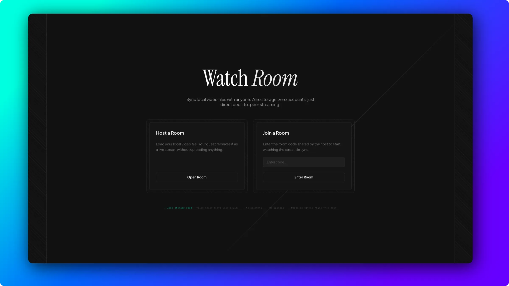

# WatchRoom 🍿

**WatchRoom** is a minimalist, peer-to-peer video synchronization tool that lets you watch local video files with friends in real-time.

## Key Features
- **P2P Streaming**: Files are streamed directly between peers using WebRTC. No servers, no uploads, and zero storage used.
- **Synced Playback**: Play, pause, and seek are synchronized across all participants.
- **Instant Rooms**: Create or join rooms with a simple 6-character code.
- **Ephemeral Chat**: Built-in chat for real-time interaction (no history saved).
- **Privacy First**: No accounts required. Your files never leave your device.

## How to Use
1. **Host**: Open the app, click "Host a Room", and select a local video file.
2. **Share**: Copy the room code and send it to your friend.
3. **Watch**: Once your friend joins, they will receive the stream automatically.

## Tech Stack
- HTML5 / Vanilla CSS
- Pure JavaScript (WebRTC for P2P)
- Hosted on GitHub Pages
